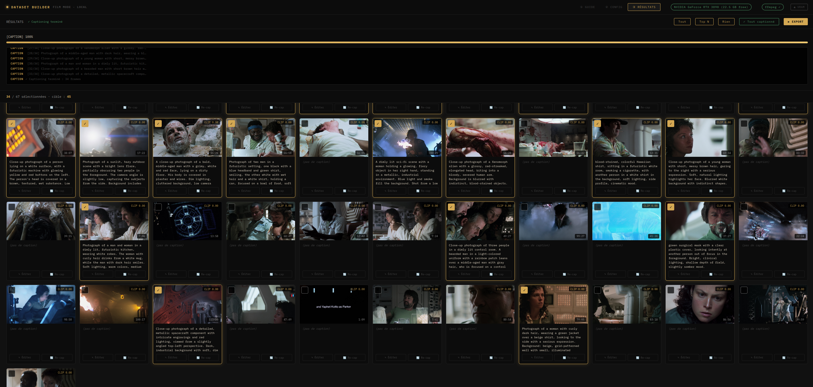
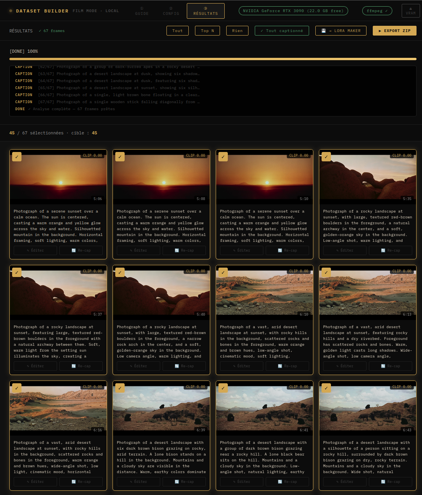
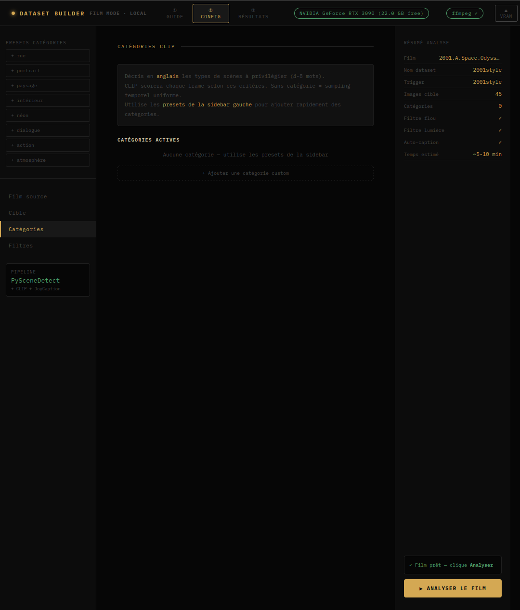
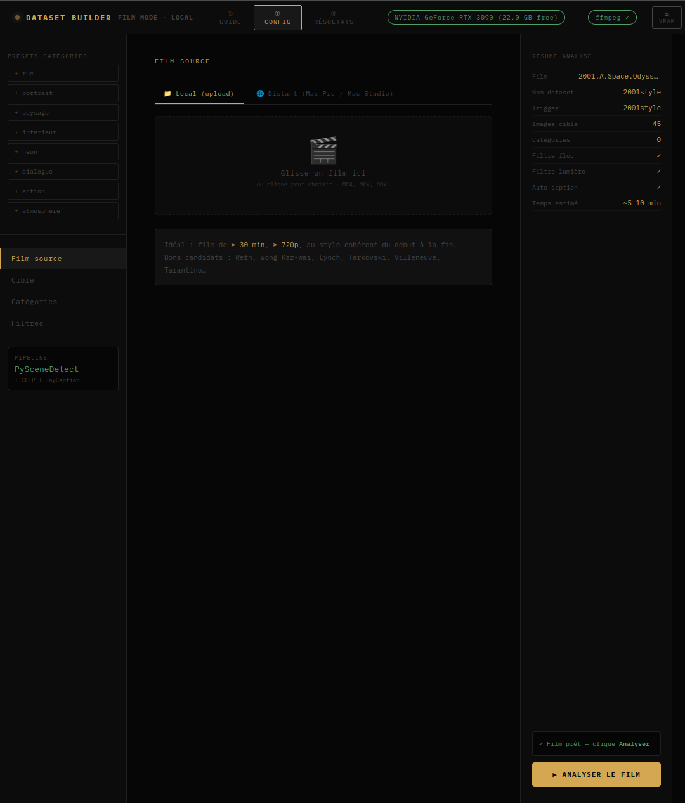
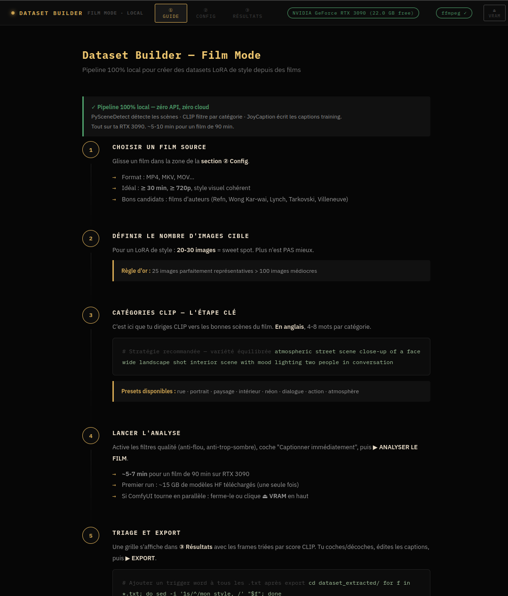

# Film LoRA Dataset Builder

Voici un Dataset Builder pour exporter des images de n'importe quel film, rush, video. L'idée est de pouvoir facilement choisir des images de séquences pour établir un dataset utilisable où vous le souhaitez. Au départ je voulais créer ça pour faire des Loras dans LTX 2.3.

Le principe : tu donnes un film, l'outil détecte automatiquement les changements de plan, extrait des frames représentatives, les filtre par qualité, les classe par pertinence sémantique (CLIP), et génère une caption descriptive pour chacune (JoyCaption). Tu ressors avec un dossier `image.jpg + image.txt` par frame — prêt à envoyer dans AI-Toolkit ou n'importe quel pipeline d'entraînement.

Tout tourne en local, pas de cloud, pas d'API payante.

---

## Interface











---

## Ce que ça fait concrètement

1. **Détection de scènes** — PySceneDetect découpe le film en plans automatiquement
2. **Extraction de frames** — ffmpeg sort 1 à 10 frames par scène (configurable), réparties uniformément dans la scène
3. **Filtres qualité** — élimine les frames floues, les fondus au noir, les transitions
4. **Scoring CLIP** — tu décris en anglais ce que tu cherches ("atmospheric street scene", "close-up portrait", etc.) et CLIP classe les frames par pertinence
5. **Captioning JoyCaption** — génère une caption descriptive en anglais pour chaque frame retenue
6. **Export ZIP** — `image_001.jpg` + `image_001.txt` pour chaque frame, prêt pour AI-Toolkit

---

## Prérequis

- GPU NVIDIA avec **≥ 12 GB de VRAM** (JoyCaption pèse ~12 GB)
- Python 3.10+
- ffmpeg (`sudo apt install ffmpeg`)
- Ubuntu / Linux

---

## Installation

```bash
git clone https://github.com/Sinclou/film-lora-dataset-builder
cd film-lora-dataset-builder

python3 -m venv venv
source venv/bin/activate
pip install -r requirements.txt
```

Installe PyTorch séparément selon ta version CUDA — voir [pytorch.org](https://pytorch.org/get-started/locally/).

**Premier lancement :** ~15 GB de modèles se téléchargent automatiquement (une seule fois).

---

## Lancement

```bash
source venv/bin/activate
python dataset_builder_v3.py
```

Ouvre **http://localhost:7862** dans ton navigateur.

```bash
# Options disponibles
python dataset_builder_v3.py --port 8080
python dataset_builder_v3.py --output /mon/dossier/datasets
python dataset_builder_v3.py --host 0.0.0.0   # accès réseau local
python dataset_builder_v3.py --no-browser
```

---

## Pour les LoRA LTX-Video

Le format de sortie est directement compatible avec AI-Toolkit (Ostris) en mode image (`frames=1`). Config recommandée :

```
model: LTX-Video 2.3 (13B)
frames: 1
resolution: 512x512
rank: 32
steps: 1500-2500
learning_rate: 1e-4
```

Ajoute un trigger word en début de chaque `.txt` avant d'entraîner.

Pour plus de détails sur l'utilisation, les catégories CLIP, le triage des frames et les conseils d'entraînement → voir [GUIDE.md](GUIDE.md).

---

*Contributions bienvenues.*
